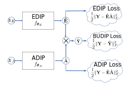

# BUDDIP: Blind Unmixing Using A Double Deep Image Prior
Official pytorch implementation of the paper "**[Blind Unmixing Using A Double Deep Image Prior](https://ieeexplore.ieee.org/abstract/document/9747545)**" (ICASSP'2022).



# Citing
If this code is helpful to you, please cite:
## BibTex
```
@INPROCEEDINGS{
  9747545,
  author={Zhou, Chao and Rodrigues, Miguel R.D.},
  booktitle={ICASSP 2022 - 2022 IEEE International Conference on Acoustics, Speech and Signal Processing (ICASSP)}, 
  title={Blind Unmixing Using A Double Deep Image Prior}, 
  year={2022},
  volume={},
  number={},
  pages={1665-1669},
  doi={10.1109/ICASSP43922.2022.9747545}
}

```